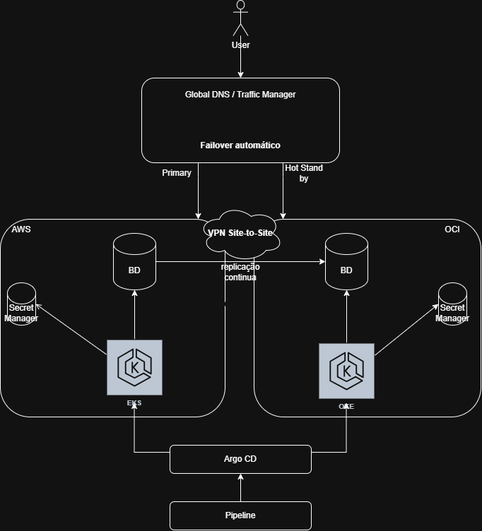

# Questão 1: Arquitetura Multi-Cloud e Alta Disponibilidade
O usuário acessará o serviço por uma camada de DNS, que normalmente direcionará o tráfego para o ambiente principal na AWS. A OCI será mantida como hot standby, com o cluster e a aplicação já em execução. Health checks serão utilizados para identificar uma indisponibilidade na AWS e, nesse caso, o tráfego será redirecionado automaticamente para a OCI, buscando o menor RTO possível.

A comunicação privada entre as duas nuvens poderá ser realizada por uma VPN site-to-site. Os clusters EKS e OKE não serão sincronizados diretamente entre si. O mesmo pipeline de CI/CD publicará a aplicação, e o Argo CD aplicará os mesmos manifests ou Helm Charts nos dois ambientes, mantendo versões equivalentes da aplicação, com os ajustes necessários para cada nuvem.

Para o banco do ERP, adotaria um banco principal na AWS com replicação contínua para uma réplica na OCI. Em caso de falha do ambiente principal, a réplica da OCI seria promovida para assumir as operações. A escolha entre replicação síncrona ou assíncrona dependeria dos requisitos de RPO e dos testes de latência. Também seria importante garantir que apenas um banco estivesse habilitado para escrita, evitando divergências entre as duas nuvens.
## Diagrama da arquitetura

# Questão 2: Infraestrutura como Código (IaC) e Segurança
Ainda não trabalhei diretamente com Terraform, então eu descrevi a solução em vez de tentar escrever um código completo.

Eu separaria os ambientes em pastas diferentes, uma para staging e outra para production, usando módulos em comum para criar o cluster Kubernetes, o banco relacional e o bucket de logs.

As variáveis serviriam para mudar configurações entre os ambientes, como tamanho do cluster, capacidade do banco, região e tempo de retenção dos logs. Os outputs mostrariam apenas informações úteis, como nome do cluster, endpoint do banco e nome do bucket, sem expor senhas ou chaves.

As credenciais ficariam em um serviço como o AWS Secrets Manager. Eu evitaria colocar senhas em arquivos .tf, .tfvars ou outputs, e a aplicação buscaria esses dados em tempo de execução usando uma role com acesso somente aos secrets necessários.

O estado do Terraform ficaria armazenado remotamente em um bucket S3 privado, criptografado e com um state separado para cada ambiente. Também usaria state locking para impedir que duas pessoas executassem alterações ao mesmo tempo.

No pipeline, deixaria etapas básicas como validação, geração do plano e aprovação antes do apply em produção. Teríamos pipelines separados para staging e produção, com permissões mais restritas para executar alterações no ambiente de produção.

# Questão 3: Pipelines CI/CD e Estratégias de Deploy

# Questão 4: Observabilidade e Troubleshooting em Tempo Real

# Questão 5: Engenharia de Performance e Custos em Kubernetes (Prática/Teórica)

# Questão 6: Cultura DevSecOps e Governança (Situacional)

